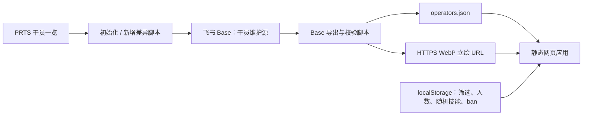

# 明日方舟干员随机抽取工具实现方案

更新日期：2026-08-01

## 一、产品目标

制作一个无需登录即可使用的网页小工具。打开后进入抽取主界面，桌面端以 2 行 × 6 列展示最多 12 张干员卡；右侧保留醒目的“开始抽取”按钮，顶部提供设置入口。整体气质参考游戏的编队界面，但界面、卡框和交互用 CSS 重新制作，不直接把带批注的参考截图当作页面背景。


设置界面遵循飞书画板 revision 11 中的构想：星级 1–6 星可多选且默认全选；八种职业可多选且默认全选；抽取人数范围为 1–12，默认 12；“随机技能”使用互斥的“是/否”开关；“ban 干员”进入独立页面，通过星级、职业和搜索快速定位并排除干员。画板没有规定随机技能默认值，首版为兼容旧行为采用默认“否”。

## 二、推荐技术方案

前端使用 Vite、React 和 TypeScript，构建为纯静态站点。它不需要常驻后端，可部署到 GitHub Pages、Cloudflare Pages 或任意静态服务器。筛选设置、抽取人数和 ban 列表保存在浏览器 `localStorage`，换设备时默认不自动同步。

数据同步使用 Node.js 脚本。PRTS 只负责初始化和发现新增干员；飞书 Base“干员库”是人工维护主数据源。导出脚本从 Base 生成前端只读的 `operators.json`。当前首版在快照中保存无需鉴权的 PRTS 媒体 CDN WebP URL，因此抽取逻辑不受飞书或 PRTS 页面结构影响，但未缓存的立绘仍需要网络；完全离线图片打包属于后续增强。



## 三、PRTS 数据同步

已经验证“干员一览”页面在隐藏的 `#filter-data` 节点中直接包含结构化属性。截至 2026-08-01，页面可解析到 423 名干员，职业覆盖先锋、近卫、重装、狙击、术师、医疗、辅助、特种。

需要提取的字段如下：

| 输出字段 | PRTS 来源 | 说明 |
|---|---|---|
| `id` | `data-id` | 作为稳定主键，ban 列表不直接存中文名 |
| `name` | `data-zh` | 中文名 |
| `rarity` | `data-rarity + 1` | PRTS 原值从 0 开始，必须加 1 才是显示星级 |
| `profession` | `data-profession` | 八大职业之一 |
| `skills` | 各干员详情页“技能”章节 | 只含战斗技能 `{index, name}`；明确无技能时为 `[]` |
| `portrait` | 立绘文件规则 / Base 人工维护 | 无需鉴权的 HTTPS WebP URL |
| `sourceUrl` | 干员页面 URL | 用于来源追溯 |
| `updatedAt` | 同步时间 | 便于检查数据时效 |

立绘优先尝试 `立绘_{干员名}_2.png`，不存在时回退到 `立绘_{干员名}_1.png`。PRTS 媒体路径遵循 MediaWiki 的 UTF-8 文件名 MD5 分目录规则。生产同步不直接使用数 MB 的原图 URL，而是记录 800px 缩略图并使用 `?image_process=format,webp/quality,Q_80` 请求 WebP；实测维什戴尔精二立绘从约 5.3 MB 降到约 143 KB。

同步脚本需要设置明确的 User-Agent、串行或低并发下载、失败重试、缓存和校验报告。上一版 PRTS 种子同时充当稳定 ID 登记表：已有干员继承旧 ID，只有新增干员或新形态分配新 ID；改名、改职业和从单形态变多形态不能重算旧 ID。生成完成后检查主键重复、星级范围、职业枚举、技能 0–3 且编号连续、图片可用率和干员总数的异常变化；默认拒绝旧干员消失和异常大批变化，同步失败不能覆盖上一份可用数据。

## 四、前端交互与随机规则

候选池由“符合已选星级”“符合已选职业”“不在 ban 列表”三个条件取交集。一次抽取不重复，采用 Fisher–Yates 洗牌；随机索引由 `crypto.getRandomValues` 生成，避免直接使用 `Math.random` 带来的偏差。若候选人数少于目标人数，界面应展示全部候选并明确提示，不静默重复干员。

抽取开始时先播放约 600–900 ms 的卡框扫描或翻牌动效，再逐张揭示结果。每张卡显示星级、职业图标、透明立绘和中文名；立绘用 `object-fit: contain` 配合可配置的 `object-position`，避免不同构图被统一裁坏。随机技能开启时，在点击“开始抽取”的同一时刻为每名结果独立、安全随机一个实际技能，并把选择写入本轮 `DrawResult`，不能在 React 渲染阶段重新随机。`skills: []` 显示“无技能”，缺少 `skills` 字段显示“技能未收录”；两种状态都不重抽干员。主界面提供再次抽取和返回设置，ban 页支持名称搜索、筛选、批量选择与清除。

桌面端保持 2 × 6 的编队感；窄屏改为可横向滑动或 2–3 列自适应，不能简单压缩到无法辨认。所有核心按钮提供键盘焦点和可读文本，动效遵循 `prefers-reduced-motion`。

## 五、飞书知识库与 Base 的定位

飞书知识库本身是文档与节点容器，不适合作为浏览器运行时数据库。当前知识库中的设置画板继续作为需求和设计入口；同一知识库下已经建立多维表格 Base“干员库”，其“干员数据”表包含干员ID、名称、星级、职业、启用、立绘URL、来源URL、同步时间、技能1、技能2、技能3、技能已核验和立绘附件。“技能已核验”用于区分“明确没有战斗技能”和“尚未录入技能”。

Base 是正式维护源，不是可选覆盖层。PRTS → Base 默认只创建缺失 ID 并报告已有记录差异，不静默覆盖人工维护的启用状态、立绘或其他字段；需要批量覆盖已有值时必须使用显式开关。Base → 静态快照只导出“启用”为真的有效记录。这样既保留飞书维护体验，也避免前端暴露飞书凭证、触发接口限流或因权限失效导致工具打不开。

个人用户的星级选择、职业选择、人数和 ban 列表属于本机偏好，优先放 `localStorage`，不写入共享 Base。只有确认需要跨设备同步或多人共享预设时，才增加后端账号体系和云端设置表。

## 六、建议目录

```text
Arknights random/
├─ 材料/                  # 原始设计参考，不在运行时直接使用
├─ docs/                  # 方案、日志与后续交接
├─ scripts/               # PRTS 同步、Base 导入导出和校验
├─ src/
│  ├─ components/         # 卡片、筛选栏、抽取按钮等
│  ├─ pages/              # 抽取页、设置页、ban 页
│  ├─ hooks/              # 正式快照加载与 fallback
│  └─ lib/                # 设置、筛选、随机与单元测试
├─ public/data/           # Base 导出的 operators.json
└─ dist/                  # 生产构建产物
```

## 七、实施顺序与验收

第一阶段已经完成主界面、设置页和 ban 页，打通筛选、抽取和本地存储。第二阶段已经完成 PRTS 同步、Base 幂等补建、Base 全量导出和 423 名正式干员接入。第三阶段已经补充随机技能、技能1–3飞书维护、官方新增干员的稳定 ID 增量对账、动效、响应式布局、异常状态和子路径兼容；本地图片缓存仍待未来按实际部署要求增加。

首版完成标准是：423 名干员数据可重复同步；官方新增时旧 ID 不变并产生可审计差异；星级、职业、人数、随机技能和 ban 都能正确生效；一次结果不重复，随机技能结果在本轮内稳定；刷新后设置仍保留；断网时已部署站点仍可使用已打包快照完成筛选与抽取，立绘失败时显示文字占位；桌面和手机布局可用；来源与非官方声明清晰可见。

## 八、主要风险

PRTS 页面结构不是正式 API，改版后解析器可能失效，因此必须有校验和上一版本回退。参考图含红色批注和截屏元素，只能作为视觉说明；正式页面需要重绘。PRTS 页面声明采用 CC BY-NC-SA 4.0，且立绘属于游戏相关素材，发布时应保留来源、署名、非官方与非商业说明；如果项目未来商业化，需要重新确认素材授权，不能直接沿用当前资源方案。
